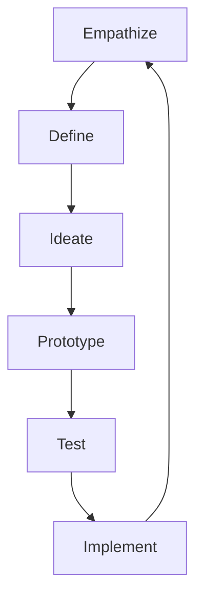

# Innovation Methodologies

## Overview

Successful innovation requires both creativity and structure. Over the years, I've mastered and adapted various methodologies to drive consistent innovation outcomes. Each framework offers unique strengths for different types of challenges and contexts.

## Design Thinking

### Process Overview


### Key Principles
- **Human-Centered**: Start with user needs
- **Iterative**: Continuous refinement
- **Collaborative**: Diverse team input
- **Experimental**: Learning by doing

### Application Example
**Challenge**: Improve customer onboarding experience

**Process**:
1. **Empathize**: 50 customer interviews
2. **Define**: Identified 5 key pain points
3. **Ideate**: Generated 100+ solutions
4. **Prototype**: Created 3 testable concepts
5. **Test**: Validated with 200 users
6. **Implement**: Launched new onboarding flow

**Results**: 60% reduction in onboarding time, 40% increase in completion rate

## Lean Startup

### Core Concepts
- **Minimum Viable Product (MVP)**: Smallest testable version
- **Build-Measure-Learn**: Rapid iteration cycle
- **Pivot or Persevere**: Data-driven decisions
- **Validated Learning**: Evidence-based progress

### Implementation Framework
```
Hypothesis → MVP → Metrics → Learning → Iteration
```

### Success Story
**Product**: AI-powered workflow automation tool

**Lean Approach**:
- **Hypothesis**: Teams will adopt AI for routine tasks
- **MVP**: Basic automation for 3 common workflows
- **Metrics**: 100 beta users, 80% adoption rate
- **Learning**: Users want more customization
- **Iteration**: Added custom workflow builder

**Outcome**: 10,000 active users, $2M ARR in 18 months

## TRIZ (Theory of Inventive Problem Solving)

### 40 Inventive Principles
1. **Segmentation**: Divide an object into independent parts
2. **Taking Out**: Separate interfering parts
3. **Local Quality**: Make each part function optimally
4. **Asymmetry**: Replace symmetrical forms with asymmetrical
5. **Merging**: Combine identical or similar parts
6. **Universality**: Make parts perform multiple functions
7. **Nesting**: Place one object inside another
8. **Anti-weight**: Counteract weight with lifting forces
9. **Preliminary Anti-action**: Counteract harmful effects
10. **Preliminary Action**: Perform required changes in advance

### TRIZ Application
**Problem**: Robotic arm too heavy for precise movements

**TRIZ Solution**:
- **Principle 31 (Porous Materials)**: Use lightweight composite materials
- **Principle 15 (Dynamism)**: Adjustable stiffness joints
- **Principle 28 (Mechanics Substitution)**: Replace mechanical with magnetic joints

**Result**: 40% weight reduction, 25% precision improvement

## Blue Ocean Strategy

### Strategy Canvas
```
High Price | Traditional | Blue Ocean
Features   |    High    |    Medium
Convenience|    Low     |    High
Speed      |  Medium    |    High
Cost       |    High    |    Low
```

### Four Actions Framework
- **Eliminate**: Remove industry standards
- **Reduce**: Factors below industry standard
- **Raise**: Factors above industry standard
- **Create**: New value factors

### Blue Ocean Example
**Industry**: Industrial automation

**Red Ocean**: Competing on features and price
**Blue Ocean**: Created "Automation-as-a-Service"

**Innovation**:
- **Eliminated**: Large upfront costs
- **Reduced**: Implementation time
- **Raised**: Customer support quality
- **Created**: Subscription-based model

**Result**: Created new market segment, 300% growth

## Six Thinking Hats

### Hat Roles
- **White Hat**: Facts and data
- **Red Hat**: Emotions and feelings
- **Black Hat**: Caution and risks
- **Yellow Hat**: Benefits and optimism
- **Green Hat**: Creativity and alternatives
- **Blue Hat**: Process and control

### Team Facilitation
**Challenge**: Design new product feature

**Session Flow**:
1. **Blue Hat**: Define objective and process
2. **White Hat**: Present market research data
3. **Green Hat**: Brainstorm creative solutions
4. **Yellow Hat**: Explore benefits and opportunities
5. **Black Hat**: Identify risks and challenges
6. **Red Hat**: Gauge emotional responses
7. **Blue Hat**: Summarize and decide next steps

## SCAMPER Technique

### Creative Thinking Prompts
- **S**ubstitute: What can be replaced?
- **C**ombine: What can be merged?
- **A**dapt: What can be adapted?
- **M**odify: What can be changed?
- **P**ut to another use: Different applications?
- **E**liminate: What can be removed?
- **R**everse: What can be rearranged?

### SCAMPER Example
**Product**: Traditional project management tool

**SCAMPER Results**:
- **Substitute**: Replace Gantt charts with AI predictions
- **Combine**: Integrate time tracking and invoicing
- **Adapt**: Apply gaming mechanics for engagement
- **Modify**: Make it voice-controlled
- **Put to another use**: Use for personal goal tracking
- **Eliminate**: Remove complex setup process
- **Reverse**: Start with deadlines and work backward

## Open Innovation

### Collaboration Models
- **Crowdsourcing**: External idea generation
- **Partnerships**: Strategic alliances
- **Acquisitions**: Buying innovation
- **Licensing**: Accessing external IP
- **Joint Ventures**: Shared development

### Implementation Strategy
```
Identify Needs → Define Scope → Select Partners → 
Establish Governance → Execute Projects → Share Value
```

### Success Factors
- **Clear Objectives**: Defined goals and metrics
- **IP Protection**: Proper legal frameworks
- **Cultural Fit**: Aligned values and approaches
- **Trust Building**: Transparent relationships

## Innovation Metrics

### Leading Indicators
- **Idea Generation**: Number of ideas submitted
- **Experiment Rate**: Number of tests conducted
- **Learning Velocity**: Speed of insight generation
- **Collaboration Index**: Cross-functional engagement

### Lagging Indicators
- **Innovation Revenue**: Percentage from new products
- **Time to Market**: Speed of commercialization
- **Success Rate**: Percentage of successful innovations
- **ROI**: Financial return on innovation investments

### Measurement Framework
| Metric | Target | Current | Trend |
|--------|--------|---------|-------|
| Ideas per Employee | 12/year | 15 | ↑ |
| Experiment Success Rate | 30% | 35% | ↑ |
| Innovation Revenue | 20% | 25% | ↑ |
| Time to Market | 6 months | 5 months | ↓ |

## Methodology Selection Guide

### Decision Matrix
| Situation | Best Methodology | Why |
|-----------|------------------|-----|
| User Experience Problem | Design Thinking | Human-centered approach |
| New Product Launch | Lean Startup | Rapid validation |
| Technical Contradiction | TRIZ | Systematic problem solving |
| Market Creation | Blue Ocean | Uncontested space |
| Team Brainstorming | Six Thinking Hats | Structured creativity |
| Product Improvement | SCAMPER | Systematic creativity |
| Resource Constraints | Open Innovation | External collaboration |

## Combining Methodologies

### Hybrid Approach Example
**Project**: Smart manufacturing system

**Combined Methodologies**:
1. **Design Thinking**: Understand worker needs
2. **TRIZ**: Solve technical contradictions
3. **Lean Startup**: Test with MVP
4. **Open Innovation**: Partner with sensor companies
5. **Six Thinking Hats**: Team decision making

**Benefits**:
- Comprehensive problem understanding
- Technical feasibility ensured
- Market validation achieved
- Resources optimized
- Team alignment maintained

## Implementation Best Practices

### Success Factors
- **Leadership Support**: Executive sponsorship
- **Clear Process**: Defined methodology steps
- **Team Training**: Skill development
- **Resources Allocation**: Time and budget
- **Culture**: Innovation-friendly environment

### Common Pitfalls
- **Methodology Overload**: Too many frameworks
- **Rigidity**: Strict adherence without adaptation
- **Lack of Follow-through**: Incomplete implementation
- **Resistance**: Cultural barriers
- **Resource Constraints**: Insufficient investment

## Future Methodologies

### Emerging Approaches
- **AI-Augmented Innovation**: Machine learning for idea generation
- **Quantum Innovation**: Quantum computing for complex problems
- **Bio-Inspired Design**: Nature-based solutions
- **Circular Innovation**: Sustainable design principles

### Continuous Learning
- **Methodology Evolution**: Adapting frameworks
- **Customization**: Tailoring to context
- **Integration**: Combining best practices
- **Measurement**: Refining effectiveness metrics

## Resources

### Books
- "The Design of Business" by Roger Martin
- "The Lean Startup" by Eric Ries
- "Blue Ocean Strategy" by W. Chan Kim
- "And Suddenly the Inventor Appeared" by Altshuller

### Tools
- **Miro/Mural**: Digital collaboration
- **IdeaScale**: Idea management
- **Proto.io**: Rapid prototyping
- **Optimizely**: A/B testing

### Training
- **Design Thinking Courses**: IDEO, Stanford d.school
- **Lean Startup Workshops**: Official programs
- **TRIZ Training**: Certified practitioners
- **Innovation Consulting**: Professional services