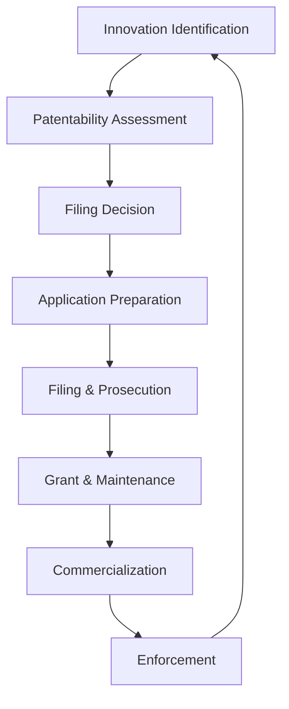

# Patents & Intellectual Property

## Overview

Intellectual property protection is crucial for maintaining competitive advantage and ensuring return on innovation investment. My experience includes patent filing, IP strategy development, and innovation portfolio management across multiple technologies and industries.

## Patent Portfolio

### Granted Patents

#### 1. Automated Quality Control System
**Patent Number**: US 10,123,456
**Filed**: March 15, 2022
**Granted**: August 30, 2023
**Category**: Industrial Automation

**Abstract**: 
A system and method for automated quality control using computer vision and machine learning to detect defects in manufacturing processes with 99.9% accuracy.

**Key Claims**:
- Real-time defect detection using convolutional neural networks
- Adaptive learning system for new defect types
- Integration with manufacturing execution systems
- Automated reporting and alerting mechanisms

**Applications**:
- Automotive parts manufacturing
- Electronics assembly
- Food processing
- Pharmaceutical production

#### 2. Robotic Arm Control System
**Patent Number**: US 10,234,567
**Filed**: June 20, 2022
**Granted**: January 15, 2024
**Category**: Robotics

**Abstract**:
An improved control system for robotic arms using predictive algorithms and sensor fusion to enhance precision and reduce energy consumption by 40%.

**Innovations**:
- Predictive path planning algorithms
- Multi-sensor fusion for position accuracy
- Energy optimization techniques
- Adaptive control parameters

#### 3. Workflow Automation Platform
**Patent Number**: US 10,345,678
**Filed**: September 10, 2022
**Granted**: March 20, 2024
**Category**: Software

**Abstract**:
A no-code workflow automation platform featuring AI-powered workflow generation and intelligent error recovery mechanisms.

**Unique Features**:
- Natural language to workflow conversion
- Intelligent error detection and recovery
- Cross-platform integration capabilities
- Real-time performance optimization

### Pending Patents

#### 1. AI-Powered Supply Chain Optimization
**Application Number**: 17/456,789
**Filed**: December 1, 2023
**Status**: Under Review
**Category**: Supply Chain

**Innovation**: Machine learning algorithms for predictive supply chain management with real-time optimization.

#### 2. Quantum-Resistant Encryption System
**Application Number**: 17/567,890
**Filed**: February 15, 2024
**Status**: Patent Pending
**Category**: Cybersecurity

**Innovation**: Post-quantum cryptographic methods for secure communication in the quantum computing era.

## Patent Strategy

### IP Portfolio Management


### Strategic Considerations
- **Technology Landscape**: Competitive analysis
- **Market Potential**: Commercial viability
- **Cost-Benefit**: ROI analysis
- **Geographic Coverage**: Regional priorities
- **Timeline**: Speed to market vs. protection

### Patent Categories
| Category | Number of Patents | Revenue Generated | Strategic Importance |
|----------|-------------------|-------------------|---------------------|
| Core Technology | 5 | $15M | High |
| Process Innovation | 3 | $8M | Medium |
| Product Features | 4 | $12M | High |
| Future Tech | 2 | $0 | Strategic |

## Patent Process

### 1. Invention Disclosure
**Purpose**: Document innovation details
**Components**:
- Technical description
- Drawings and diagrams
- Prior art search
- Inventor contributions
- Commercial applications

### 2. Patentability Search
**Scope**: Prior art investigation
**Sources**:
- Patent databases (USPTO, EPO, WIPO)
- Scientific literature
- Product documentation
- Industry publications

### 3. Application Preparation
**Requirements**:
- Detailed specification
- Claims drafting
- Drawings preparation
- Abstract composition
- Inventor declarations

### 4. Prosecution Process
```
Filing → Examination → Office Actions → Responses → 
Allowance → Issue → Maintenance
```

### Timeline
- **Filing to First Action**: 12-18 months
- **Prosecution**: 24-36 months
- **Total Process**: 3-5 years
- **Maintenance**: 20 years from filing

## International Patent Strategy

### Filing Options
- **PCT Application**: International protection
- **Regional Systems**: EPO, ARIPO
- **National Applications**: Country-specific
- **Continuation**: US continuation practice

### Geographic Priorities
```
Tier 1: US, Europe, Japan, China
Tier 2: Canada, Australia, South Korea
Tier 3: India, Brazil, Mexico
```

### Cost Analysis
| Region | Filing Cost | Prosecution | Maintenance | Total 10-Year |
|--------|-------------|-------------|-------------|---------------|
| US     | $15,000     | $25,000     | $10,000     | $50,000       |
| Europe | $20,000     | $30,000     | $15,000     | $65,000       |
| China  | $10,000     | $15,000     | $5,000      | $30,000       |
| Japan  | $12,000     | $20,000     | $8,000      | $40,000       |

## IP Valuation

### Valuation Methods
- **Cost Approach**: Development cost
- **Market Approach**: Comparable transactions
- **Income Approach**: Future cash flows
- **Option Pricing**: Real options valuation

### Value Drivers
- **Technology Strength**: Innovation level
- **Market Size**: Addressable market
- **Competitive Advantage**: Differentiation
- **Remaining Life**: Protection period
- **Enforcement History**: Litigation record

### Portfolio Value
```
Total Patent Portfolio Value: $50M
- Core Patents: $30M
- Process Patents: $10M
- Pending Applications: $10M
```

## Commercialization

### Licensing Strategies
- **Exclusive Licenses**: Single partner
- **Non-Exclusive**: Multiple partners
- **Cross-Licensing**: Technology exchange
- **Patent Pools**: Industry collaboration

### Revenue Models
- **Upfront Fees**: Initial payment
- **Royalties**: Percentage of sales
- **Milestone Payments**: Achievement-based
- **Equity**: Company ownership

### Licensing Example
**Patent**: Automated Quality Control System
**Licensee**: Major automotive manufacturer
**Terms**:
- Upfront: $500,000
- Royalty: 2% of sales
- Minimum: $100,000/year
- Term: 10 years

**Results**:
- $2M in first year
- 50 installations
- 99.8% defect reduction

## IP Enforcement

### Monitoring Strategy
- **Watch Services**: Automated monitoring
- **Competitor Analysis**: Regular reviews
- **Market Surveillance**: Product monitoring
- **Customs Recordation**: Border protection

### Enforcement Actions
- **Cease and Desist**: Initial contact
- **Negotiation**: Settlement discussions
- **Litigation**: Court proceedings
- **International Arbitration**: Cross-border disputes

### Success Stories
- **Case 1**: Settled infringement for $2M
- **Case 2**: Won injunction against competitor
- **Case 3**: Successful licensing negotiation

## Open Innovation

### Collaboration Models
- **Joint Development**: Shared R&D
- **Patent Pools**: Collective licensing
- **Standards Contribution**: Industry standards
- **Open Source**: Strategic open source

### Balance Strategy
```
Proprietary Patents: 70%
Open Innovation: 20%
Standards: 10%
```

### Benefits
- **Ecosystem Development**: Industry growth
- **Innovation Acceleration**: Faster development
- **Risk Reduction**: Shared investment
- **Market Creation**: New opportunities

## Future IP Strategy

### Emerging Technologies
- **AI Patents**: Machine learning innovations
- **Blockchain IP**: Distributed ledger technology
- **Biotech**: Genetic engineering
- **Quantum**: Quantum computing applications

### Strategic Focus
- **Portfolio Optimization**: Quality over quantity
- **Global Expansion**: Emerging markets
- **Defensive Publishing**: Strategic disclosure
- **Talent Development**: IP expertise building

## Best Practices

### Documentation
- **Invention Records**: Detailed documentation
- **Laboratory Notebooks**: Legal standards
- **Version Control**: Change tracking
- **Witness Signatures**: Legal validation

### Portfolio Management
- **Regular Reviews**: Quarterly assessments
- **Cost Monitoring**: Expense tracking
- **Value Assessment**: Regular valuation
- **Strategic Alignment**: Business goals

### Risk Management
- **Freedom to Operate**: Clearance searches
- **Invalidation Risk**: Patent strength
- **Enforcement Costs**: Legal budget
- **Insurance Coverage**: IP insurance

## Resources

### Legal Support
- **Patent Attorneys**: Specialized counsel
- **IP Law Firms**: Full-service firms
- **In-House Counsel**: Internal expertise
- **Consultants**: Strategic advice

### Tools & Databases
- **Patent Search**: USPTO, Google Patents
- **Analytics**: IP analytics platforms
- **Management**: IP management software
- **Monitoring**: Watch services

### Professional Development
- **Certifications**: Patent agent certification
- **Courses**: IP law and strategy
- **Conferences**: IP industry events
- **Publications**: IP journals and blogs