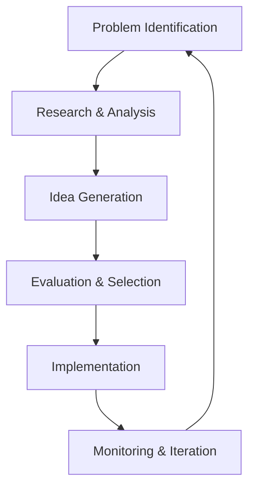

# Creative Problem Solving

## Overview

Complex problems require creative solutions that go beyond conventional thinking. My problem-solving approach combines analytical rigor with creative exploration to develop innovative solutions that address root causes and create lasting value.

## Problem-Solving Framework

### 6-Step Process


### Step 1: Problem Identification
- **Symptom Recognition**: Observable issues
- **Root Cause Analysis**: 5 Whys technique
- **Problem Framing**: Clear definition
- **Scope Definition**: Boundaries and constraints

### Step 2: Research & Analysis
- **Data Collection**: Quantitative and qualitative
- **Stakeholder Analysis**: Understanding perspectives
- **Context Research**: Industry and market analysis
- **Benchmarking**: Best practice identification

### Step 3: Idea Generation
- **Divergent Thinking**: Quantity over quality initially
- **Cross-Pollination**: Ideas from different domains
- **Analogical Thinking**: Solutions from similar problems
- **Constraint Removal**: "What if" scenarios

### Step 4: Evaluation & Selection
- **Feasibility Assessment**: Technical and resource evaluation
- **Impact Analysis**: Potential benefits measurement
- **Risk Assessment**: Potential downsides identification
- **Prioritization**: Ranking based on criteria

### Step 5: Implementation
- **Solution Design**: Detailed planning
- **Resource Allocation**: Budget and team assignment
- **Execution**: Project management
- **Change Management**: Stakeholder buy-in

### Step 6: Monitoring & Iteration
- **Performance Tracking**: KPI monitoring
- **Feedback Collection**: User and stakeholder input
- **Adjustment**: Course corrections
- **Learning**: Documentation and sharing

## Creative Thinking Techniques

### Mind Mapping
**Purpose**: Visual exploration of ideas and connections

**Process**:
1. Start with central problem/topic
2. Branch out with main categories
3. Add sub-branches with details
4. Use colors and images for memory
5. Look for patterns and connections

**Example**: Improving customer service
```
Customer Service
├── People
│   ├── Training
│   ├── Motivation
│   └── Skills
├── Process
│   ├── Response Time
│   ├── Resolution
│   └── Follow-up
├── Technology
│   ├── CRM System
│   ├── AI Chatbots
│   └── Analytics
└── Measurement
    ├── CSAT
    ├── NPS
    └── Resolution Rate
```

### Reverse Brainstorming
**Concept**: Instead of solving the problem, create it

**Process**:
1. Reverse the problem: "How to make customer service worse?"
2. Generate ideas for worsening the situation
3. Reverse each idea to find solutions
4. Prioritize reversed solutions

**Example**:
- Make customers wait longer → Implement 24/7 support
- Give wrong information → Create knowledge base
- Be unavailable → Add multiple contact channels
- Be rude → Train empathy skills

### Analogical Thinking
**Approach**: Find solutions from unrelated fields

**Examples**:
- **Problem**: Factory floor communication
- **Analogy**: Ant colony communication
- **Solution**: Pheromone-like digital signals for routing

- **Problem**: Software bug detection
- **Analogy**: Immune system detection
- **Solution**: Automated anomaly detection system

### Six Word Stories
**Technique**: Condense problem/solution into six words

**Examples**:
- "Complex workflow simplified through automation"
- "Customer frustration turned into delight"
- "Data chaos transformed into actionable insights"

## Advanced Problem-Solving Methods

### First Principles Thinking
**Approach**: Break down to fundamental truths

**Process**:
1. Identify current assumptions
2. Break down to basic elements
3. Question each element
4. Reconstruct from fundamentals

**Example**: Reducing manufacturing costs
- **Assumption**: Current process is optimal
- **Breakdown**: Materials, labor, energy, overhead
- **Question**: Why each cost element exists
- **Reconstruction**: New process eliminating waste

### Systems Thinking
**Perspective**: View problems as interconnected systems

**Tools**:
- **Causal Loop Diagrams**: Visualize relationships
- **Stock and Flow**: Understand accumulations
- **Leverage Points**: Identify high-impact interventions

**Example**: Employee turnover problem
```
Low Morale → High Turnover → Increased Costs → 
Reduced Training → Lower Skills → Lower Quality → 
Customer Complaints → More Stress → Lower Morale
```

### Design of Experiments (DOE)
**Method**: Systematic approach to testing variables

**Process**:
1. Identify factors to test
2. Design experimental matrix
3. Run experiments
4. Analyze results
5. Optimize based on findings

**Application**: Optimizing robot arm performance
- **Factors**: Speed, precision, energy consumption
- **Design**: Full factorial experiment
- **Results**: Optimal settings identified
- **Improvement**: 30% performance increase

## Problem-Solving Case Studies

### Case Study 1: Supply Chain Disruption
**Problem**: COVID-19 disrupted global supply chain

**Approach**:
1. **Analysis**: Identified single-source dependencies
2. **Ideation**: Diversification, localization, digitalization
3. **Solution**: Multi-sourcing + digital twin
4. **Implementation**: 6-month transition plan
5. **Results**: 95% supply continuity maintained

### Case Study 2: Software Quality Issues
**Problem**: High bug rate in production

**Root Cause Analysis**:
- **Symptom**: 50 bugs/month in production
- **5 Whys**:
  1. Why bugs? → Code issues
  2. Why code issues? → Poor testing
  3. Why poor testing? → No time
  4. Why no time? → Tight deadlines
  5. Why tight deadlines? → Poor planning

**Solution**: Shift-left testing approach
- **Result**: 80% reduction in production bugs

### Case Study 3: Customer Churn
**Problem**: 25% annual customer churn

**Creative Solutions**:
- **Predictive Analytics**: Identify at-risk customers
- **Proactive Outreach**: Personalized retention efforts
- **Value Demonstration**: Regular ROI reports
- **Community Building**: User groups and forums

**Outcome**: Churn reduced to 10%

## Decision-Making Tools

### Decision Matrix
**Purpose**: Systematic evaluation of options

**Example**: Selecting new technology
```
Criteria (Weight) | Option A | Option B | Option C
Cost (30%)        |    7     |    9     |    6
Features (25%)    |    9     |    7     |    8
Support (20%)     |    8     |    8     |    9
Scalability (15%) |    7     |    6     |    9
Security (10%)    |    9     |    8     |    7
-----------------------------------------------
Weighted Score    |   7.9    |   7.6    |   7.7
```

### Cost-Benefit Analysis
**Framework**:
- **Quantitative Benefits**: Revenue, cost savings
- **Qualitative Benefits**: Satisfaction, brand
- **Costs**: Implementation, maintenance, training
- **ROI Calculation**: (Benefits - Costs) / Costs

### Risk Assessment Matrix
```
Impact/Probability | High | Medium | Low
-------------------|------|--------|-----
High               | Red  | Orange | Yellow
Medium             | Orange| Yellow | Green
Low                | Yellow| Green  | Green
```

## Innovation Traps

### Common Pitfalls
- **Analysis Paralysis**: Overthinking without action
- **Confirmation Bias**: Seeking confirming evidence
- **Groupthink**: Conformity over creativity
- **Sunk Cost Fallacy**: Continuing failing projects
- **Not Invented Here**: Rejecting external ideas

### Mitigation Strategies
- **Timeboxing**: Limit analysis time
- **Devil's Advocate**: Assign dissenting role
- **Diverse Teams**: Multiple perspectives
- **Stage Gates**: Regular review points
- **Open Innovation**: External idea sourcing

## Problem-Solving Metrics

### Effectiveness Measures
- **Solution Success Rate**: Percentage of successful implementations
- **Time to Resolution**: Speed of problem solving
- **Cost Efficiency**: Resource utilization
- **Stakeholder Satisfaction**: User and team feedback

### Innovation Metrics
- **Novelty Score**: Originality of solutions
- **Implementation Rate**: Ideas converted to action
- **Impact Measurement**: Business value created
- **Learning Capture**: Knowledge retention

## Team Problem Solving

### Optimal Team Composition
- **Diverse Backgrounds**: Different perspectives
- **Complementary Skills**: Technical and creative
- **Psychological Safety**: Safe to share ideas
- **Clear Roles**: Defined responsibilities

### Facilitation Techniques
- **Round Robin**: Equal participation
- **Silent Brainstorming**: Reduce bias
- **Anonymous Voting**: Objective selection
- **Dot Voting**: Democratic prioritization

## Future Problem Solving

### Emerging Approaches
- **AI-Assisted Problem Solving**: Machine learning for pattern recognition
- **Crowd Solving**: Mass collaboration platforms
- **Quantum Problem Solving**: Quantum computing for complex optimization
- **Bio-Inspired Solutions**: Nature-based problem solving

### Skill Development
- **Systems Thinking**: Holistic perspective
- **Computational Thinking**: Algorithmic approach
- **Design Thinking**: Human-centered approach
- **Critical Thinking**: Logical analysis

## Resources

### Tools
- **Miro**: Digital whiteboard
- **Lucidchart**: Diagramming
- **MindMeister**: Mind mapping
- **IdeaFlip**: Digital brainstorming

### Techniques
- **SCAMPER**: Creative thinking
- **Six Thinking Hats**: Structured creativity
- **TRIZ**: Systematic innovation
- **Design Sprints**: Rapid prototyping

### Learning
- **Coursera**: Problem-solving courses
- **edX**: Critical thinking programs
- **LinkedIn Learning**: Creative thinking
- **MasterClass**: Innovation insights