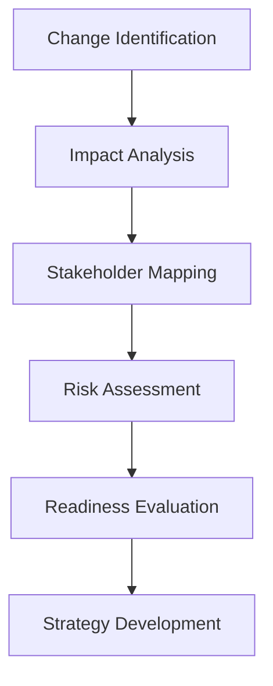

# Change Management

## Overview

Change is constant in today's business environment. Effective change management requires a delicate balance of strategic vision, empathetic leadership, and tactical execution. My approach focuses on minimizing disruption while maximizing adoption and benefit realization.

## Change Management Framework

### 1. Assessment Phase


### 2. Planning Phase
- **Communication Strategy**: Clear, consistent messaging
- **Training Plan**: Skill development and support
- **Implementation Timeline**: Phased rollout approach
- **Success Metrics**: Measurement and evaluation criteria

### 3. Execution Phase
- **Leadership Alignment**: Unified front from management
- **Employee Engagement**: Active participation and feedback
- **Progress Monitoring**: Real-time tracking and adjustment
- **Support Systems**: Resources and assistance

### 4. Reinforcement Phase
- **Success Celebration**: Acknowledging achievements
- **Feedback Integration**: Continuous improvement
- **Cultural Integration**: Embedding new behaviors
- **Sustainability Planning**: Long-term maintenance

## Types of Change

### Organizational Change
- **Restructuring**: Departmental realignment
- **Mergers & Acquisitions**: Cultural integration
- **Leadership Transitions**: Executive changes
- **Process Reengineering**: Workflow optimization

### Technology Change
- **System Implementation**: New software/platforms
- **Digital Transformation**: Technology modernization
- **Automation**: Process automation initiatives
- **Cloud Migration**: Infrastructure changes

### Cultural Change
- **Values Evolution**: Shifting organizational beliefs
- **Behavior Change**: New ways of working
- **Diversity & Inclusion**: Cultural transformation
- **Innovation Culture**: Fostering creativity

## Change Management Models

### ADKAR Model
```
Awareness → Desire → Knowledge → Ability → Reinforcement
```

**Application**:
- **Awareness**: Communicating need for change
- **Desire**: Building motivation to change
- **Knowledge**: Providing training and information
- **Ability**: Developing skills and capabilities
- **Reinforcement**: Sustaining the change

### Lewin's Change Model
```
Unfreeze → Change → Refreeze
```

**Implementation**:
- **Unfreeze**: Prepare for change, create urgency
- **Change**: Implement new processes and behaviors
- **Refreeze**: Solidify new state, prevent regression

### Kotter's 8-Step Process
1. Create Urgency
2. Form Powerful Coalition
3. Create Vision for Change
4. Communicate Vision
5. Remove Obstacles
6. Create Short-Term Wins
7. Build on Change
8. Anchor Change in Culture

## Communication Strategy

### Stakeholder Analysis
| Stakeholder Group | Impact | Influence | Strategy |
|-------------------|--------|-----------|----------|
| Executive Team | High | High | Direct involvement |
| Managers | High | Medium | Training and support |
| Employees | High | Low | Clear communication |
| Customers | Medium | Medium | Regular updates |
| Partners | Medium | Low | Information sharing |

### Communication Channels
- **Town Halls**: Company-wide meetings
- **Team Meetings**: Departmental updates
- **Email Updates**: Regular information sharing
- **Intranet**: Central resource hub
- **One-on-Ones**: Personal discussions

### Message Framework
- **Why**: Rationale for change
- **What**: Specific changes occurring
- **How**: Implementation approach
- **When**: Timeline and milestones
- **Who**: Roles and responsibilities

## Resistance Management

### Common Sources of Resistance
- **Fear of Unknown**: Uncertainty about future
- **Loss of Control**: Reduced autonomy
- **Skill Gaps**: Inadequate capabilities
- **Habit Breaking**: Comfort with status quo
- **Trust Issues**: Lack of confidence in leadership

### Mitigation Strategies
```
Identify Resistance → Understand Concerns → 
Address Issues → Provide Support → 
Monitor Progress → Adjust Approach
```

### Engagement Techniques
- **Early Involvement**: Participate in planning
- **Feedback Mechanisms**: Voice concerns
- **Champion Programs**: Peer support
- **Success Stories**: Share positive examples

## Training & Development

### Training Needs Assessment
- **Skill Gap Analysis**: Current vs. required capabilities
- **Learning Styles**: Varied delivery methods
- **Role-Specific Needs**: Tailored content
- **Timing Considerations**: Just-in-time learning

### Training Delivery Methods
- **Instructor-Led**: Classroom or virtual
- **E-Learning**: Self-paced modules
- **On-the-Job**: Practical application
- **Mentoring**: Peer support and guidance

### Support Systems
- **Help Desk**: Technical and process support
- **Documentation**: User guides and resources
- **Office Hours**: Expert consultation
- **Community Forums**: Peer assistance

## Case Studies

### Case Study 1: Agile Transformation
**Organization**: Software development company (500 employees)
**Change**: Transition from waterfall to agile methodology

**Challenges**:
- Cultural resistance to new processes
- Skills gap in agile practices
- Management skepticism
- Timeline pressure

**Approach**:
- Pilot program with one team
- Comprehensive training program
- Leadership coaching
- Gradual rollout across organization

**Results**:
- 40% faster time-to-market
- 30% improvement in quality
- 25% increase in team satisfaction
- 100% adoption within 12 months

### Case Study 2: Merger Integration
**Organizations**: Two competing tech companies
**Change**: Post-merger cultural and system integration

**Complexities**:
- Differing corporate cultures
- Redundant systems and processes
- Employee uncertainty
- Customer retention concerns

**Strategy**:
- Cultural assessment and integration plan
- System consolidation roadmap
- Communication campaign
- Retention programs for key talent

**Outcomes**:
- 95% employee retention
- Successful system integration
- 20% cost synergies realized
- Improved market position

### Case Study 3: Digital Transformation
**Organization**: Traditional manufacturing company
**Change**: Implementation of Industry 4.0 technologies

**Obstacles**:
- Workforce digital literacy
- Legacy system dependencies
- Investment justification
- Change fatigue

**Implementation**:
- Digital skills training program
- Phased technology rollout
- Quick win demonstration projects
- Continuous improvement culture

**Achievements**:
- 50% increase in productivity
- 35% reduction in defects
- 28% cost savings
- Enhanced competitive position

## Measurement & Evaluation

### Success Metrics
- **Adoption Rate**: Percentage using new processes/systems
- **Proficiency Level**: Capability assessment scores
- **Business Impact**: ROI and performance improvements
- **Employee Satisfaction**: Engagement and morale metrics

### Evaluation Framework
```
Kirkpatrick's Four Levels:
1. Reaction: Satisfaction with change
2. Learning: Knowledge and skill acquisition
3. Behavior: Application of new skills
4. Results: Business impact
```

### Continuous Improvement
- **Feedback Collection**: Regular input gathering
- **Metrics Review**: Performance analysis
- **Adjustment Implementation**: Process refinement
- **Success Documentation**: Best practice capture

## Leadership Role in Change

### Essential Leadership Behaviors
- **Vision Communication**: Inspiring and clear direction
- **Role Modeling**: Demonstrating commitment
- **Active Listening**: Understanding concerns
- **Decision Making**: Timely and confident choices
- **Resilience**: Maintaining momentum

### Leadership Actions
- **Champion Change**: Visible support and advocacy
- **Remove Barriers**: Address obstacles and blockers
- **Provide Resources**: Ensure necessary support
- **Celebrate Success**: Recognize achievements
- **Maintain Focus**: Keep attention on goals

## Future of Change Management

### Emerging Trends
- **AI-Powered Analytics**: Predictive change modeling
- **Personalized Change**: Individualized approaches
- **Real-Time Adaptation**: Dynamic adjustment capabilities
- **Continuous Change**: Ongoing evolution mindset

### Skills Development
- **Change Agility**: Rapid adaptation capabilities
- **Digital Literacy**: Technology change management
- **Emotional Intelligence**: People-centric leadership
- **Systems Thinking**: Holistic perspective

## Best Practices Summary

### Do's
- Communicate early and often
- Involve stakeholders in planning
- Provide adequate training and support
- Celebrate milestones and successes
- Monitor progress and adjust

### Don'ts
- Underestimate resistance
- Rush implementation
- Neglect communication
- Ignore feedback
- Assume one-size-fits-all

## Resources

### Change Management Tools
- **Project Management**: Asana, Monday.com, Jira
- **Communication**: Slack, Teams, Email platforms
- **Survey Tools**: SurveyMonkey, Google Forms
- **Analytics**: Power BI, Tableau, Google Analytics

### Professional Development
- **Certification Programs**: Prosci, Change Management Institute
- **Books**: "Leading Change" by John Kotter
- **Communities**: Change Management LinkedIn Groups
- **Conferences**: ACMP Global Conference