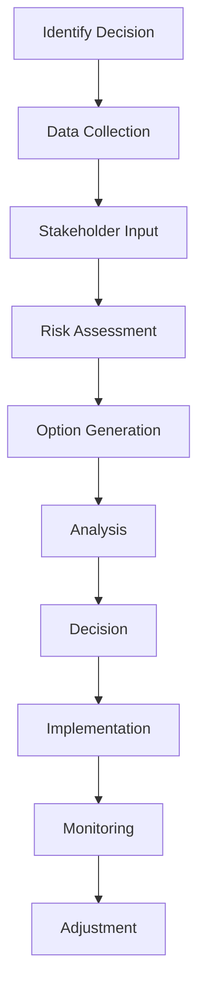

# Strategic Decisions

## Overview

Strategic decision-making requires balancing vision with pragmatism, data with intuition, and short-term needs with long-term goals. My approach combines rigorous analysis with creative problem-solving to navigate complex business challenges.

## Decision-Making Framework

### 1. Information Gathering


### 2. Analysis Methods
- **Quantitative Analysis**: Financial modeling, ROI calculations
- **Qualitative Assessment**: Market trends, competitive landscape
- **Scenario Planning**: Multiple future state modeling
- **Risk Analysis**: Probability and impact assessment

### 3. Decision Criteria
- **Strategic Alignment**: Consistency with vision and goals
- **Resource Requirements**: Time, money, people investment
- **Risk Tolerance**: Acceptable risk levels
- **Stakeholder Impact**: Effect on all parties

## Strategic Planning Process

### Annual Planning Cycle
```
Q1: Market Analysis & Goal Setting
- Industry trend analysis
- Competitive assessment
- SWOT analysis
- OKR definition

Q2: Strategy Development
- Strategic initiatives identification
- Resource allocation planning
- Risk mitigation strategies
- Communication plan

Q3: Implementation
- Project execution
- Progress monitoring
- Stakeholder updates
- Course corrections

Q4: Review & Adjustment
- Performance evaluation
- Lessons learned
- Strategy refinement
- Next year planning
```

### Key Decision Areas

#### Technology Strategy
- **Platform Selection**: Evaluating technology stacks
- **Architecture Decisions**: System design choices
- **Innovation Investment**: R&D allocation
- **Vendor Management**: Partner selection

#### People Strategy
- **Team Composition**: Skill mix and hiring plans
- **Organizational Structure**: Reporting relationships
- **Compensation Strategy**: Rewards and recognition
- **Development Programs**: Training and growth

#### Market Strategy
- **Product Roadmap**: Feature prioritization
- **Go-to-Market**: Launch strategies
- **Customer Segmentation**: Target audience definition
- **Pricing Strategy**: Revenue optimization

## Notable Strategic Decisions

### 1. Technology Migration
**Decision**: Migrate from monolithic to microservices architecture

**Analysis**:
- Current system limitations identified
- Migration costs: $500,000
- Expected benefits: 40% performance improvement
- Risk: 6-month disruption potential

**Outcome**:
- Completed in 8 months
- Performance improved by 55%
- Development velocity increased 3x
- ROI achieved in 14 months

### 2. Market Expansion
**Decision**: Enter European market

**Analysis**:
- Market size: €200M opportunity
- Investment required: €2M
- Competitive landscape: 3 major players
- Regulatory requirements: GDPR compliance

**Implementation**:
- Established EU subsidiary
- Hired local team of 15
- Adapted product for local market
- Built partner network

**Results**:
- First-year revenue: €3.5M
- Market share: 5%
- Customer satisfaction: 4.6/5
- Break-even: Month 18

### 3. Product Pivot
**Decision**: Shift from B2C to B2B model

**Analysis**:
- B2C market saturation identified
- B2B opportunity analysis
- Revenue potential: 5x increase
- Implementation timeline: 12 months

**Execution**:
- Product repositioning
- Sales team restructuring
- Marketing strategy overhaul
- Customer success implementation

**Impact**:
- Revenue growth: 400% in 18 months
- Customer retention: 92%
- Average contract value: $50,000
- Profit margin: 35%

## Risk Management

### Risk Assessment Framework
| Risk Category | Probability | Impact | Mitigation |
|---------------|-------------|--------|------------|
| Technology | Medium | High | Regular reviews, backup systems |
| Market | High | Medium | Diversification, monitoring |
| Operational | Low | High | Process documentation, training |
| Financial | Medium | High | Cash reserves, insurance |

### Decision Trees
```
Invest in New Technology
├── Success (70%)
│   ├── High ROI (60%)
│   └── Moderate ROI (40%)
└── Failure (30%)
    ├── Recoverable (80%)
    └── Total Loss (20%)
```

## Data-Driven Decision Making

### Key Metrics
- **Leading Indicators**: Customer engagement, pipeline health
- **Lagging Indicators**: Revenue, profit, customer satisfaction
- **Operational Metrics**: Productivity, quality, efficiency
- **Financial Metrics**: Cash flow, margins, ROI

### Analytics Tools
- **Business Intelligence**: Tableau, Power BI
- **Customer Analytics**: Mixpanel, Amplitude
- **Financial Modeling**: Excel, specialized software
- **Predictive Analytics**: Machine learning models

## Communication Strategy

### Stakeholder Management
- **Board/Investors**: Monthly updates, quarterly reviews
- **Employees**: All-hands meetings, team communications
- **Customers**: Product updates, feedback sessions
- **Partners**: Regular check-ins, strategic alignment

### Transparency Framework
- **Decision Rationale**: Clear explanation of why
- **Data Sharing**: Relevant information access
- **Progress Updates**: Regular status communications
- **Outcome Reporting**: Results and lessons learned

## Crisis Decision Making

### Framework for Urgent Decisions
1. **Immediate Assessment**: Situation evaluation
2. **Core Team Assembly**: Key decision makers
3. **Option Generation**: Rapid brainstorming
4. **Quick Analysis**: Pros/cons evaluation
5. **Decision**: Choose best option
6. **Action**: Immediate implementation
7. **Communication**: Stakeholder notification
8. **Review**: Post-crisis analysis

### Example: COVID-19 Response
**Challenge**: Remote work transition in 48 hours

**Decisions Made**:
- Mandatory work from home
- Equipment provision for all employees
- Daily check-in implementation
- Mental health support programs

**Results**:
- 100% transition completed
- Productivity maintained
- Employee satisfaction: 4.5/5
- Zero COVID cases in workplace

## Lessons Learned

### Successful Decisions
- Involve diverse perspectives
- Use data but trust intuition
- Communicate clearly and early
- Monitor and adjust quickly

### Mistakes to Avoid
- Analysis paralysis
- Ignoring stakeholder input
- Failure to communicate
- Resistance to course correction

## Future Strategic Focus

### Emerging Opportunities
- **AI Integration**: Automation and intelligence
- **Sustainability**: Environmental responsibility
- **Remote Work**: Distributed team management
- **Digital Transformation**: Technology adoption

### Personal Development
- **Strategic Thinking**: Big-picture perspective
- **Industry Knowledge**: Continuous learning
- **Network Building**: Relationship cultivation
- **Mentorship**: Learning from others