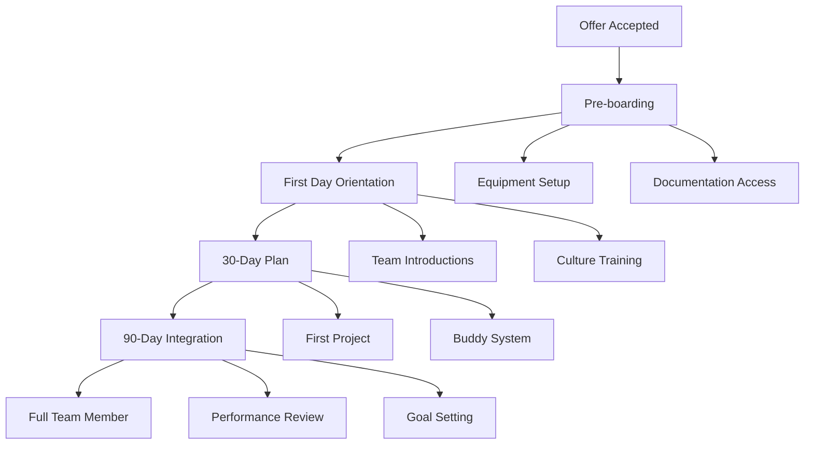

# Team Management

## Overview

Effective team management is the cornerstone of organizational success. My approach focuses on creating environments where talented individuals can collaborate effectively, innovate freely, and achieve extraordinary results together.

## Team Building Strategies

### 1. Talent Acquisition
- **Strategic Hiring**: Aligning team composition with business goals
- **Cultural Fit**: Ensuring alignment with organizational values
- **Diversity & Inclusion**: Building diverse, high-performing teams
- **Skill Assessment**: Comprehensive evaluation of technical and soft skills

### 2. Onboarding Excellence


### 3. Team Structure Optimization
- **Role Clarity**: Defined responsibilities and expectations
- **Communication Channels**: Efficient information flow
- **Decision Making**: Clear authority and processes
- **Collaboration Framework**: Tools and methodologies

## Performance Management

### Goal Setting Framework
- **OKRs (Objectives and Key Results)**: Quarterly goal alignment
- **SMART Goals**: Specific, Measurable, Achievable, Relevant, Time-bound
- **Individual Development Plans**: Personal growth objectives
- **Team KPIs**: Collective performance metrics

### Regular Check-ins
```
Weekly: 1:1 meetings (30 minutes)
- Progress review
- Blocker identification
- Resource needs
- Feedback exchange

Monthly: Team meetings (60 minutes)
- Goal progress
- Team updates
- Cross-functional collaboration
- Recognition and celebration

Quarterly: Performance reviews (60 minutes)
- Achievement assessment
- Skill development
- Career planning
- Compensation discussion
```

### Feedback Culture
- **Continuous Feedback**: Real-time recognition and improvement
- **360-Degree Reviews**: Comprehensive perspective gathering
- **Constructive Approach**: Focus on growth and development
- **Actionable Insights**: Clear improvement pathways

## Team Development

### Skill Building Programs
- **Technical Training**: Latest technologies and best practices
- **Soft Skills**: Communication, leadership, collaboration
- **Cross-Training**: Multi-skill development
- **Certification Support**: Professional development investment

### Career Pathing
```
Individual Contributor Track:
Junior → Mid-level → Senior → Principal → Architect

Leadership Track:
Team Lead → Manager → Director → VP → Executive

Dual Track Options:
Technical Lead → Manager of Engineering → Director of Technology
```

### Knowledge Sharing
- **Brown Bag Sessions**: Regular learning presentations
- **Documentation**: Comprehensive knowledge base
- **Mentorship Programs**: Peer-to-peer learning
- **Conference Attendance**: External knowledge acquisition

## Conflict Resolution

### Proactive Measures
- **Clear Expectations**: Defined roles and responsibilities
- **Regular Communication**: Open dialogue channels
- **Team Building**: Relationship strengthening activities
- **Early Intervention**: Addressing issues before escalation

### Resolution Process
1. **Private Discussion**: Understanding individual perspectives
2. **Mediation**: Facilitated conversation between parties
3. **Solution Identification**: Collaborative problem-solving
4. **Agreement**: Clear action items and follow-up
5. **Monitoring**: Ensuring resolution effectiveness

## Remote Team Management

### Best Practices
- **Communication Protocols**: Clear guidelines for virtual collaboration
- **Time Zone Management**: Inclusive scheduling practices
- **Virtual Team Building**: Remote engagement activities
- **Trust Building**: Outcome-based performance management

### Tools and Technologies
- **Project Management**: Jira, Asana, Monday.com
- **Communication**: Slack, Teams, Zoom
- **Documentation**: Confluence, Notion, GitLab
- **Collaboration**: Miro, Figma, Google Workspace

## Success Metrics

### Team Performance Indicators
| Metric | Target | Current | Trend |
|--------|--------|---------|-------|
| Productivity | +20% YoY | +25% | ↑ |
| Employee Satisfaction | >4.5/5 | 4.7 | ↑ |
| Retention Rate | >90% | 94% | → |
| Innovation Index | 5+ ideas/quarter | 7 | ↑ |

### Quality Metrics
- **Code Quality**: Automated testing coverage >80%
- **Delivery Reliability**: On-time delivery >95%
- **Customer Satisfaction**: NPS >50
- **Incident Response**: MTTR <4 hours

## Case Study: Team Transformation

### Initial State
- Low morale and engagement
- High turnover (35% annually)
- Missed deadlines (40% late)
- Poor communication

### Interventions
1. **Leadership Training**: Management skill development
2. **Process Improvement**: Agile implementation
3. **Team Restructuring**: Role realignment
4. **Culture Initiative**: Values reinforcement

### Results (12 months)
- **Turnover**: Reduced to 8%
- **On-time Delivery**: Improved to 96%
- **Employee Satisfaction**: Increased from 2.8 to 4.6
- **Productivity**: Increased by 40%

## Lessons Learned

### What Works
- Regular, transparent communication
- Empowering team autonomy
- Investing in development
- Celebrating successes

### What to Avoid
- Micromanagement
- Inconsistent expectations
- Neglecting feedback
- Resistance to change

## Future Focus

### Emerging Trends
- **AI-Augmented Teams**: Leveraging AI for productivity
- **Gig Economy Integration**: Managing hybrid workforces
- **Skills-Based Hiring**: Focus on capabilities over credentials
- **Continuous Learning**: Lifelong development culture

### Development Areas
- **Emotional Intelligence**: Enhanced people skills
- **Change Agility**: Adapting to rapid change
- **Digital Leadership**: Managing remote/hybrid teams
- **Innovation Management**: Fostering creativity